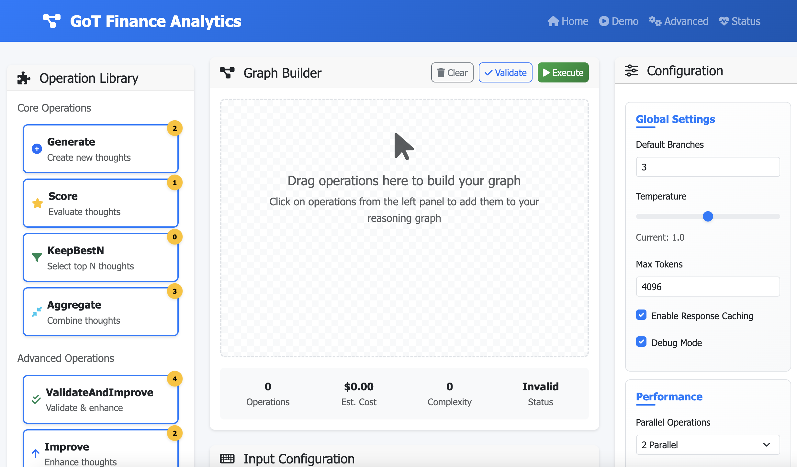

# Graph of Thoughts Finance Web App

Financial analysis platform using the Graph of Thoughts (GoT) framework for complex reasoning patterns. Built with Flask and powered by Cerebras API for advanced language model capabilities.

## Screenshot

<div align="center">
  
</div>

<p align="center">
  <em>Interactive demo showing risk analysis workflow with Graph of Thoughts reasoning visualization</em>
</p>

## Features

### Core GoT Capabilities
- **Complex Operation Graphs**: Generate, Score, KeepBestN, Aggregate operations
- **Multiple Reasoning Strategies**: IO, CoT, ToT, and GoT variants
- **Sophisticated Parsers**: Finance-specific response parsing
- **Advanced Thought Transformations**: Validation and improvement cycles
- **Cost Tracking**: Real-time performance and cost metrics

### Finance-Specific Use Cases
- **Risk Analysis & Portfolio Management**: Analyze risk factors across multiple 10-K filings
- **Financial Document Processing**: Merge earnings call transcripts and identify themes
- **Due Diligence Automation**: Compare financial metrics across acquisition targets
- **Regulatory Compliance**: Analyze requirements across jurisdictions
- **Market Research & Analysis**: ESG factor analysis from analyst reports
- **Credit Analysis**: Extract consistent risk indicators from credit memos

## 🏗️ Architecture

```
Frontend (Flask Templates + Bootstrap)
    ↓
Backend (Flask + Custom Finance Workflows)
    ↓
Graph of Thoughts Framework
    ↓
Cerebras API (LLM Processing)
```

## 📦 Installation

### Prerequisites
- Python 3.8+
- Cerebras API key

### Setup Instructions

1. **Clone the repository:**
```bash
git clone https://github.com/yourusername/got-finance-webapp.git
cd got-finance-webapp
```

2. **Create virtual environment:**
```bash
python -m venv venv
source venv/bin/activate 
```

3. **Install dependencies:**
```bash
pip install -r requirements.txt
```

4. **Clone Graph of Thoughts framework:**
```bash
git clone https://github.com/spcl/graph-of-thoughts.git
cd graph-of-thoughts
pip install -e .
cd ..
```

5. **Set up environment variables:**
```bash
cp .env.example .env
# Edit .env and add your CEREBRAS_API_KEY
```

6. **Create configuration file:**
```bash
cp config_template.json config.json
# Edit config.json with your settings
```

7. **Initialize data directories:**
```bash
mkdir -p data/sample_documents data/results
```

## 🚀 Running the Application

```bash
python app.py
```

Visit `http://localhost:8080` to access the web interface.

## Usage Guide

### Basic Demo
1. Navigate to `/demo`
2. Select a finance workflow (Risk Analysis, Document Merge, etc.)
3. Upload or enter sample data
4. Choose reasoning complexity (IO, CoT, ToT, GoT)
5. Execute and view results

### Advanced Configuration
1. Visit `/advanced` for custom graph building
2. Drag and drop operations to create complex reasoning flows
3. Configure parameters for each operation
4. Export/import custom workflows
5. Monitor performance metrics

## Configuration

### Environment Variables (.env)
```
CEREBRAS_API_KEY=your_api_key_here
SECRET_KEY=your_secret_key_here
FLASK_ENV=development
MAX_COST_LIMIT=10.00
```

### GoT Configuration (config.json)
```json
{
  "cerebras": {
    "model_id": "llama-3.3-70b",
    "temperature": 1.0,
    "max_tokens": 4096,
    "prompt_token_cost": 0.0,
    "response_token_cost": 0.0
  }
}
```

## Finance Workflows

### Risk Analysis
- **Input**: Multiple 10-K filings or risk documents
- **Process**: Extract → Score → Aggregate → Rank
- **Output**: Prioritized risk factors with severity scores

### Document Merge
- **Input**: Quarterly earnings transcripts
- **Process**: Parse → Extract Themes → Aggregate → Rank
- **Output**: Consolidated themes with frequency analysis

### Compliance Analysis
- **Input**: Regulatory texts from multiple jurisdictions
- **Process**: Extract Requirements → Compare → Identify Conflicts
- **Output**: Compliance matrix with conflict resolution

### Financial Metrics
- **Input**: Financial statements or data
- **Process**: Extract Metrics → Compare → Rank → Score
- **Output**: Investment attractiveness rankings

## Development

### Project Structure
```
├── app.py                 # Main Flask application
├── finance_workflows/     # Custom GoT implementations
│   ├── prompters.py      # Finance-specific prompts
│   ├── parsers.py        # Response parsing logic
│   ├── workflows.py      # GoT workflow definitions
│   └── utils.py          # Utility functions
├── templates/            # HTML templates
├── static/              # CSS, JS, images
└── data/                # Sample data and results
```

### Adding New Workflows
1. Create prompter in `finance_workflows/prompters.py`
2. Add parser in `finance_workflows/parsers.py`
3. Define workflow in `finance_workflows/workflows.py`
4. Add route in `app.py`
5. Create template in `templates/`

### API Endpoints
- `GET /` - Main landing page
- `GET /demo` - Interactive demo interface
- `GET /advanced` - Advanced graph builder
- `POST /api/execute` - Execute GoT workflow
- `GET /api/workflows` - List available workflows
- `GET /api/health` - Health check


## Acknowledgments

- [Graph of Thoughts](https://github.com/spcl/graph-of-thoughts) - Core reasoning framework
- [Cerebras](https://cerebras.ai/) - High-performance language model API
- [Flask](https://flask.palletsprojects.com/) - Web framework
- [Bootstrap](https://getbootstrap.com/) - UI components


---
